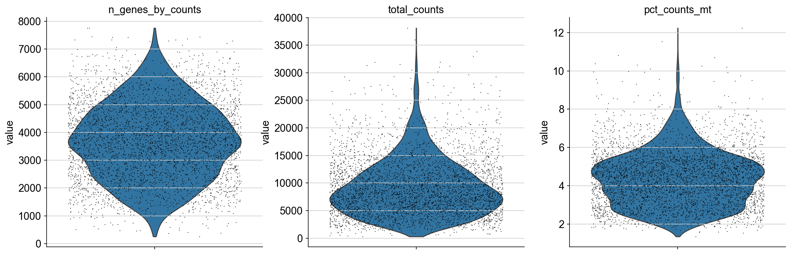

#### Basic processing (Quality Control and Intergration) of Raw spatial RNA-seq Data
Author: "Xiaoqian Jiang"  
Date: "Created on  Jan 29, 2025"  

#### Introduction   

This document outlines fundamental steps for processing raw spatial RNA-seq data, focusing on quality control and data integration.  
Metrics such as the proportion of mitochondrial gene expression (<15%), total UMI counts per spot (e.g., minimum of 500), and the number of detected spot per genes (>3) are evaluated to assess data quality, by using Scanpy.  
Identifying highly variable genes (HVGs) across all samples collectively provides a consistent feature set for integration. Batch correction methods, Scanorama used here, utilize these shared HVGs to align datasets, thereby preserving biological variability while minimizing technical discrepancies.    
    
    


#### Step 1: Set the clean environment and Load the required libraries ####

```{python step1, eval=FALSE}

# Notice that: need to use the preset squidpy environment, need to check every time to ensure using the correct python interpreter. C:/Users/xqbus/anaconda3/envs/squidpy/python.exe

%reset -f
import sys
print(sys.version)

import os
import scanpy as sc
import squidpy as sq
import gzip
import pandas as pd    

SEED = 42
import random
random.seed(SEED)
import numpy as np
np.random.seed(SEED)

import matplotlib.pyplot as plt
import anndata as ad


# Set the direction and get the raw data by scanpy
os.chdir('C:/Users/xqbus/Desktop/spatial_trans') # Your own directory
output_dir = 'C:/Users/xqbus/Desktop/spatial_trans'
output_path = os.path.join(output_dir, "results")
anndata_path =  os.path.join(output_dir, "anndata") # save path of anndata


```
#### Step 2: :Create and Initial Anndata object

```{python step2, eval=FALSE}

# List all files in the project directory, download from https://www.ncbi.nlm.nih.gov/geo/query/acc.cgi
data_dir = os.path.join(output_dir, "GSE189487_RAW") 
files = [f for f in os.listdir(data_dir) if f.startswith("GSM")]


# Process and organize files into subdirectories
for file in files:
    # Extract the sample name (e.g., "TD1" from "GSM5702473_TD1_matrix.mtx.gz")
    sample_name = file.split("_")[1]  # Get "TD1", "TD2", etc.

    # Create the subdirectory if it doesn't exist
    sample_dir = os.path.join(data_dir, sample_name)
    os.makedirs(sample_dir, exist_ok=True)
    
    # Generate the new file path inside the subdirectory
    new_file_path = os.path.join(sample_dir, "_".join(file.split("_")[2:]))
    
    # Move the file to the sample directory
    os.rename(os.path.join(data_dir, file), new_file_path)
    
# Creat anndata and store all the samples with both gene expression and postion information

sample_ids = sorted(os.listdir(data_dir))  # Samples to load

adata_dict = {} 
for sample_id in sample_ids:   
    
    # Step 1: Load the expression matrix
    adata = sc.read_10x_mtx(
        path=os.path.join(data_dir, sample_id),
        var_names="gene_symbols",  # Use gene symbols instead of gene IDs
        make_unique=True           # Ensure unique gene names
    )
    
    # Step 2: Load spatial positions and add to AnnData
    with gzip.open(os.path.join(data_dir, sample_id, "tissue_positions_list.csv.gz"), "rt") as f:
        positions = pd.read_csv(f, header=None)
        positions.columns = ["barcode", "in_tissue", "array_row", "array_col", "pxl_row_in_fullres", "pxl_col_in_fullres"]    
    # Add spatial positions to the AnnData object
    adata.obs = adata.obs.join(positions.set_index("barcode"), how='left')
    
    # # Filter to include only barcodes that are in tissue
    # positions = positions[positions["in_tissue"] == 1]
    # overlap = set(adata.obs_names) & set(positions["barcode"])
    
    # Store array coordinates in obsm['spatial']    
    adata.obsm['spatial'] = adata.obs[['array_row', 'array_col']].to_numpy()   
    # Store pixel coordinates in obsm['pixel_coords']
    adata.obsm['pixel_coords'] = adata.obs[['pxl_row_in_fullres', 'pxl_col_in_fullres']].to_numpy()
   
    # Step 3: Add adata to the dictionay and Save the anndata to local environment
    adata_dict[sample_id] = adata
    file_path = os.path.join(anndata_path, f'{sample_id}.h5ad')
    adata.write(file_path)

```
#### Step 3: Quality control for each sample

This step outlines a comprehensive workflow for preprocessing gene expression data, ensuring high-quality downstream analysis, including:  
1) Quality Control (QC): Cells expressing fewer than 500 genes and genes detected in fewer than 3 cells,    
2) the percentage of mitochondrial gene expression per cell is calculated.  
3) Normalization and Log Transformation  
4) Identification of Highly Variable Genes (HVGs): Genes exhibiting high variability across spots are identified  
5) Principal Component Analysis (PCA) and UMAP are performed to reduce the dataset's dimensionality    
6) Neighborhood Graph Construction  
7) Clustering and Visualization: The Leiden algorithm is applied at multiple resolutions to identify clusters of similar spots, and UMAP visualization.  


```{python step3, eval=FALSE}
# Reload the anndata from local files and conduct quality control for each sample separately.
adata_dict = {}
file_list = [f for f in os.listdir(anndata_path) if (f.endswith('.h5ad') & f.startswith('TD')) and not f.endswith('_processed.h5ad')  ]

for file_name in file_list:
    sample_id = file_name.replace('.h5ad', '')  # sample ID
    file_path = os.path.join(anndata_path, file_name)
    adata_dict[sample_id] = sc.read(file_path)
    
# print(adata_dict)
# print(adata_dict['TD6'].obs.head())  # Check spatial metadata


```
In spatial transcriptomics data analysis, quality control (QC) is crucial to ensure the reliability of downstream analyses. One common QC metric is the proportion of reads mapping to mitochondrial genes within each spot. A high percentage of mitochondrial reads can indicate potential issues such as cell damage or low mRNA capture efficiency.   
However, recent studies suggest that the traditional approach of removing spots with elevated mitochondrial content may not always be appropriate. For instance, in cancer research, malignant cells often exhibit higher baseline mitochondrial gene expression. Applying standard filtering thresholds could inadvertently exclude viable and functionally significant subpopulations of malignant cells.  
Therefore, while assessing mitochondrial read percentages is a valuable QC step, it's essential to interpret this metric within the broader context of the specific tissue and study. Instead of applying rigid global thresholds, adopting more nuanced, data-driven approaches (like SpotSweeper ) can help retain biologically meaningful data while ensuring quality.
Here, we calculated the proportion of mitochondrial genes and filter cells according to mitochondrial genes >15% in initial step.    

```{python step4, eval=FALSE}
# Quality control for each sample
for sample_id, adata in adata_dict.items():       
    adata.var_names_make_unique()    
    sc.pp.filter_cells(adata, min_genes=200)
    sc.pp.filter_genes(adata, min_cells = 3)
    # 1. Filter cells with counts <500, and genes with cells <5 
    adata.var['mt']= adata.var_names.str.startswith('MT-')
    sc.pp.calculate_qc_metrics(adata, qc_vars=["mt"], inplace=True)

    # For example, remove cells with more than 10% mitochondrial content
    adata = adata[adata.obs.pct_counts_mt<15, :]
    
    
    # generate violin plots for assessing the distribution of quality control (QC) metrics
    # save the figure
    figure_path = os.path.join(output_path, f"qc_after_{sample_id}.png")
    # Set Scanpy figure parameters
    sc.settings.set_figure_params(dpi=300, figsize=(12, 6))
    sc.pl.violin(adata,['n_genes_by_counts','total_counts','pct_counts_mt'],
             jitter=0.4, multi_panel=True, show=False)
    plt.savefig(figure_path, bbox_inches='tight')
    plt.close()    
    
    # n_genes_by_counts: Number of genes expressed in each cell.
    # total_counts: Total number of counts (UMIs) per cell.
    # pct_counts_mt: Percentage of counts attributed to mitochondrial genes per cell.
    # jitter=0.4: Adds a slight random noise to the data points to prevent overlap and provide a clearer visualization.
    # multi_panel=True: Displays each metric in a separate subplot for clarity.
    
    
    # Accessing Specific QC Metrics, for instance, mitochondrial gene-related metrics
    # adata.obs[['total_counts_mt', 'pct_counts_mt']].head()
    # Removing Unnecessary QC Metrics,  Columns from "obs" or from "var"
    # adata.obs.drop(columns=['log1p_n_genes_by_counts', 'log1p_total_counts'], inplace=True)
    # adata.var.drop(columns=['log1p_mean_counts', 'log1p_total_counts'], inplace=True)
    
    # Filter cells with high mitochondrial genes > 20%
    # ddata = adata[adata.obs.pct_counts_mt<20,:]
    
    # Notice: Quality Control (sc.pp.calculate_qc_metrics): Calculates metrics to assess data quality without altering the original expression data, storing in var "log1p_total_counts". 
    # Normalization and Log Transformation (sc.pp.normalize_total and sc.pp.log1p): Directly modify the expression data  in "adata.X" to prepare it for further analysis.
    
    # 2.Normalization and Log Transformation:
    sc.pp.normalize_total(adata, inplace=True)
    sc.pp.log1p(adata)
    
    # 3. Identifying Highly Variable Genes:
    sc.pp.highly_variable_genes(adata, min_mean=0.0125, max_mean=3, min_disp=0.5)
    #sc.pp.highly_variable_genes(adata, flavor="seurat", n_top_genes=3000)
    # Saving the Current State to raw, ohter wise it changed adata.X
    adata.raw = adata
    #adata = adata[:, adata.var.highly_variable]
    
    # # Check the shape of the raw matrix; it should reflect the original number of genes
    # print(adata.raw.X.shape)
    # # Check the shape of the current X matrix; it should reflect the number of highly variable genes
    # print(adata.X.shape)    
    
    # save the figure
    figure_path = os.path.join(output_path, f"highly_variable_gene_{sample_id}.png")
    # Set Scanpy figure parameters
    sc.settings.set_figure_params(dpi=300, figsize=(10, 6))
    sc.pl.highly_variable_genes(adata, show=False)
    plt.savefig(figure_path, bbox_inches='tight')
    plt.close() 
   
    # # The following steps of scaling data to [0,1]is not necessary for intergration by using Scanorama 
    # # Regressing Out Unwanted Variations:removes the influence of specified variables—in this case, 'total_counts'  and 'pct_counts_mt' 
    # sc.pp.regress_out(adata, ['total_counts', 'pct_counts_mt'])
    # # Scaling the Data: standardizes the expression values for each gene to have a mean of zero and a variance of one.
    # sc.pp.scale(adata, max_value=10)

    # 4. PCA analysis
    sc.tl.pca(adata, svd_solver='arpack')
    # save the figure
    figure_path = os.path.join(output_path, f"pca_{sample_id}.png")
    # Set Scanpy figure parameters
    sc.settings.set_figure_params(dpi=300, figsize=(10, 6))
    sc.pl.pca_variance_ratio(adata, log=True, show=False)
    plt.savefig(figure_path, bbox_inches='tight')
    plt.close() 
    
    # 5. Compute the neighborhood graph using the PCA representation of the data matrix. Therefore, you don't need to manually specify additional parameters; sc.pp.neighbors will automatically run PCA.
    sc.pp.neighbors(adata, n_neighbors=10, n_pcs=20)
    
    # 6. Embed the neighborhood graph using methods like UMAP for dimensionality reduction.
    # sc.tl.umap offers various parameters for optimizing the embedding:
    # - min_dist and spread: Adjust the tightness and spread of clusters.
    # - n_components: Set the dimensionality reduction to 2D or 3D.
    sc.tl.umap(adata, random_state=SEED)
    
    # Visualize the UMAP embedding with specific genes highlighted
    # visualizations are based on raw data by default. Set 'use_raw=False' during visualization to use processed data instead.
    # Adjustable parameters (e.g., size, cmap, alpha) can help optimize UMAP visualization effects
    # The 'color' parameter specifies data columns for visualization, which can be: Gene names (e.g., CD3D, NKG7), or other columns (e.g., leiden, cell_type).

    # sc.pl.umap(adata, color=['CD3D','NKG7', 'MS4A1', 'EPCAM'], use_raw=False)
    
    # 7. Cluster the neighborhood graph using the Leiden algorithm for graph-based clustering
    # Define the resolutions to test
    resolutions = [0.1, 0.3, 0.5, 1.0]

    # Create a canvas with multiple subplots
    fig, axes = plt.subplots(1, len(resolutions), figsize=(5 * len(resolutions), 5))
    for ax, res in zip(axes, resolutions):
        key_name = f'leiden_{res}'  # Assign a unique key for each resolution's clustering result
        sc.tl.leiden(adata, resolution=res, key_added=key_name, random_state=SEED)
        sc.pl.umap(adata, color=key_name, ax=ax, show=False, use_raw=False)
        ax.set_title(f'Leiden Clustering\nResolution = {res}')
    # Adjust the spacing between subplots
    plt.tight_layout()
    # Save the figure to the specified path
    figure_path = os.path.join(output_path, f"leiden_clustering_resolutions_{sample_id}.png")
    plt.savefig(figure_path, bbox_inches='tight')
    plt.close()
    
    # It's important to note that while UMAP provides a visual representation that can suggest clustering structures, it does not perform clustering itself. Conversely, the Leiden algorithm performs clustering based on the structure of the neighborhood graph and is independent of any dimensionality reduction technique. Therefore, the clustering results from the Leiden algorithm are not influenced by the UMAP embedding.
    sample_filename = os.path.join(anndata_path, f"{sample_id}_processed.h5ad")
    adata.write(sample_filename)


```
 

For the TD1 sample, several key QC metrics are typically assessed and visualized in the above violin plot:
left panel: the distribution of genes across spots.A higher number of detected genes per spot suggests better data quality
Middle panel: the distribution of total UMI counts across spots.
Right panel: the distribution of mitochondrial gene percentages across spots. Elevated mitochondrial gene expression can indicate cell stress or degradation. Spots with a high percentage of mitochondrial transcripts may be flagged for further investigation or exclusion.

#### Step 4: Data Integration Using Scanorama

X_scanorama is a low-dimensional representation (embedding) of the integrated single-cell RNA-seq data, not spatial information.It contains the corrected low-dimensional features (usually PCA-like) that can be used for downstream analyses such as UMAP, clustering, or other dimensionality reductions.
X_scanorama does not store spatial coordinates. It is derived from the gene expression data (single-cell RNA-seq).
If your data contains spatial transcriptomics information (e.g., coordinates in obsm['spatial']), this information is not affected or modified by scanorama.correct_scanpy.
Spatial coordinates remain stored separately in adata.obsm['spatial'].  
Scanorama: Corrects batch effects but leaves datasets separate. You need to manually concatenate the datasets afterward.

Please notice that: Identifying  highly variable genes (HVGs) within each sample separately may result in a limited overlap of HVGs across samples, hindering effective batch effect correction. Therefore, this approach involves identifying highly variable genes (HVGs) across all six samples collectively, rather than within each sample individually, to ensure a sufficient number of shared HVGs for effective batch effect correction using Scanorama. Selecting HVGs collectively ensures that the same set of genes is used for all samples, providing a consistent basis for comparison and integration. 

```{python step5, eval=FALSE}

import scanorama
from scipy.sparse import csr_matrix

# Reload the processed anndata from local files
adata_processed = {}
file_list = [f for f in os.listdir(anndata_path) if f.endswith('_processed.h5ad')]
for file_name in file_list:
    sample_id = file_name.replace('_processed.h5ad', '')  # sample ID
    file_path = os.path.join(anndata_path, file_name)
    adata_processed[sample_id] = sc.read(file_path)
    # transfer .X to csr_matrix
    adata_processed[sample_id] .X = adata_processed[sample_id] .X.tocsr()
    
# print(adata_processed)
# print(adata_processed['TD6'].obs.head())  # Check spatial metadata
# print(adata_processed['TD6'].obs['in_tissue'])  # Check spatial metadata

adatas = list(adata_processed.values())
sample_names = list(adata_processed.keys())
# Rename the cell from which sample
for adata, sample_name in zip(adatas, sample_names):
    adata.obs['library_id'] = sample_name


# Combine all samples in adata_processed using the named keys, and find common highly variable genes across all samples
adatas = list(adata_processed.values())  # Extract the AnnData objects
adata_combined = sc.concat(
    adatas, 
    label="library_id",       # Use the sample names as a batch key
    keys=list(adata_processed.keys()),  # The keys from the adata_processed dictionary
    index_unique="-",         # Append the library name to observation indices
    uns_merge="unique"        # Merge .uns elements uniquely
)
sc.pp.highly_variable_genes(
    adata_combined,
    flavor="seurat_v3",  # Seurat v3 suit for cross-sample selection
    n_top_genes=3000,
    batch_key="library_id"   
)

common_genes = adata_combined.var_names[adata_combined.var.highly_variable]
adatas = [adata[:, common_genes] for adata in adatas]

adata_cor = scanorama.correct_scanpy(adatas, return_dimred= True)

# Rename the sample 
adata_dict = {sample_name: adata for sample_name, adata in zip(sample_names, adata_cor)}
# adata_dict['TD1'].obsm['X_scanorama'][1:5,1:5]

# Save the file and reload
np.save('./anndata/adata_dict.npy', adata_dict)

adata_dict = np.load('./anndata/adata_dict.npy', allow_pickle=True).item()

adata_spatial = sc.concat(
    adata_dict,
    label="library_id",
    index_unique="-",
    #The index_unique="-" parameter appends the dataset name (from label="library_id") to each observation.
    uns_merge="unique",
)
# Save the file and reload
adata_spatial.write('./anndata/adata_spatial.h5ad')
adata_spatial = ad.read('./anndata/adata_spatial.h5ad')


```
Key Point: No Spatial Correction in Either Step. Neither scanorama.correct_scanpy nor sc.concat performs spatial coordinate correction. Here's what happens:  
scanorama.correct_scanpy:  Focuses entirely on gene expression batch correction. Corrects batch effects in expression data but does not adjust spatial positions.  
sc.concat: Merges spatial datasets but does not align or correct spatial coordinates across batches.  

#### Step 5: Data Visulazition 
```{python step6, eval=FALSE}

# Visualize spatial data using sc.pl.spatial when the spatial coordinates are stored in adata.obsm['spatial']

n_rows = 2
n_cols = 3
fig, axes = plt.subplots(n_rows, n_cols, figsize=(20, 10))
axes = axes.flatten()

library_ids = adata_spatial.obs['library_id'].unique()
for lib, ax in zip(library_ids, axes):
    # Subset the data for the current library_id
    adata_subset = adata_spatial[adata_spatial.obs['library_id'] == lib].copy()
    sc.pl.spatial(
        adata_subset,
        color='leiden_0.5',  # Color by Leiden clustering results
        img_key=None,        # No background image
        spot_size=1.5,        # Adjust this value as needed
        title=f"Spatial plot for {lib} - Leiden Clusters",
        ax=ax,   
        show=False
        # Additional parameters as needed
    ) 
    ax.set_aspect('auto')
for ax in axes[len(library_ids):]:
    ax.axis('off')    
plt.tight_layout()   
 
# save the figure
figure_path = os.path.join(output_path, f"spatial_leiden_6sample.png")
plt.savefig(figure_path, bbox_inches='tight',dpi=300)
plt.close(fig)


```


   

The image illustrates the spatial distribution of clusters identified in six independent spatial transcriptomics samples (TD1, TD2, TD3, TD5, TD6, and TD8). Each sample has been clustered separately using the Leiden algorithm based on hihgly variable genes, and the clusters are visualized in distinct colors.
 
Notice that: each of the six samples has been clustered independently, resulting in individual clustering outcomes for each sample. Consequently, even though the same color palette is applied across all samples, a specific color in one sample does not correspond to the same cell type or cluster in another sample. This independent clustering approach leads to results that are not directly comparable across samples.

To achieve meaningful comparisons and ensure that identical colors represent the same cell types or clusters across all samples, it is essential to integrate the datasets and proess clustering again. 

```{python step7, eval=FALSE}


# Check batch effect
adata_raw = adatas[0].concatenate(
    adatas[1:], 
    batch_key="library_id", 
    index_unique=None
)

# Raw data before batch effect
sc.pp.pca(adata_raw)
sc.pp.neighbors(adata_raw)
sc.tl.umap(adata_raw)
sc.tl.leiden(adata_raw, key_added="cluster_raw")
sc.pl.umap(
    adata_raw, color=["cluster_raw", "library_id"], 
    palette=sc.pl.palettes.vega_20_scanpy,
    show=False)   
plt.savefig("./results/batch_effect_before.png", dpi=300, bbox_inches="tight")

# Scanorama data after batch effect
sc.tl.pca(adata_spatial)  
sc.pp.neighbors(adata_spatial, use_rep="X_scanorama")
sc.tl.umap(adata_spatial)  # This stores results in adata_spatial.obsm["X_umap"]
sc.tl.leiden(adata_spatial, key_added="cluster_scanorama")

sc.pl.umap(
    adata_spatial, color=["cluster_scanorama", "library_id"], 
    palette=sc.pl.palettes.vega_20_scanpy,
    show=False)   
plt.savefig("./results/batch_effect_after.png", dpi=300, bbox_inches="tight")


```

   
    
The plot shows results of before and after batch effect correction using Scanorama, visualized using UMAP with Leiden clustering and sample annotations.  
Before Batch Effect Correction:  
The colors clearly show separation based on library/sample, indicating that batch effects dominate the clustering structure. Each sample forms a distinct cluster, suggesting technical variation is masking meaningful biological patterns.  
After Batch Effect Correction (Using Scanorama):  
Samples from different libraries now overlap significantly, demonstrating that the batch effects have been successfully mitigated. However, TD2 remains as a separate cluster, which suggests that this sample has unique characteristics that were not fully aligned with the rest of the dataset.  
A plausible explanation for TD2 clustering separately, even after batch effect correction, is its elevated mitochondrial gene expression levels (~10%, which is much higher compared to other samples with ~4%).   
```{python step8, eval=FALSE}


```


```{python step9, eval=FALSE}


```

