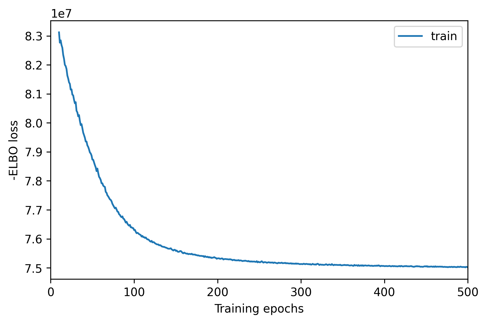
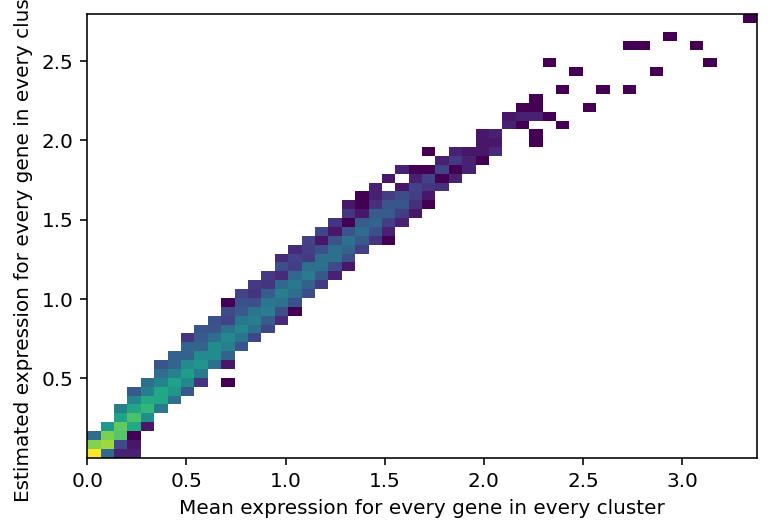
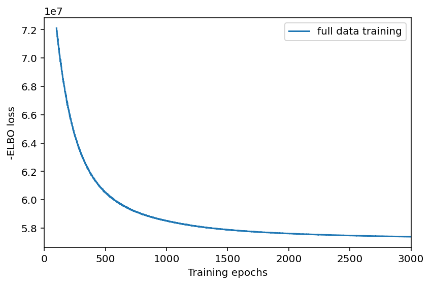
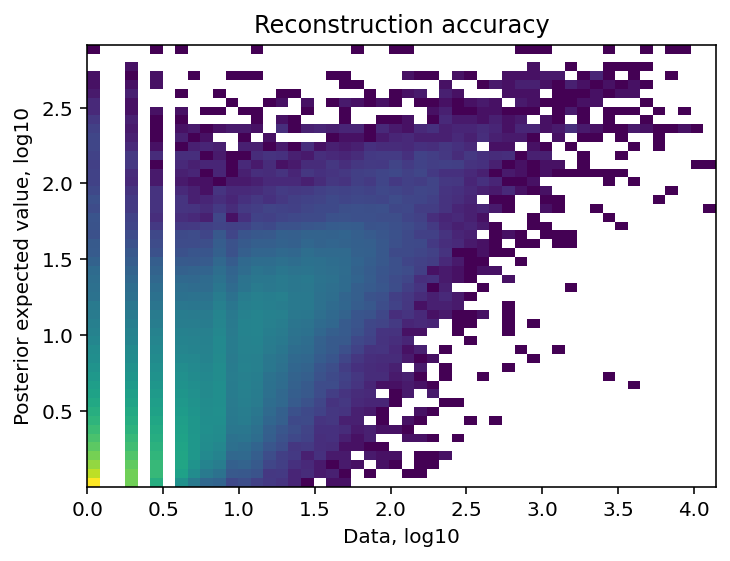
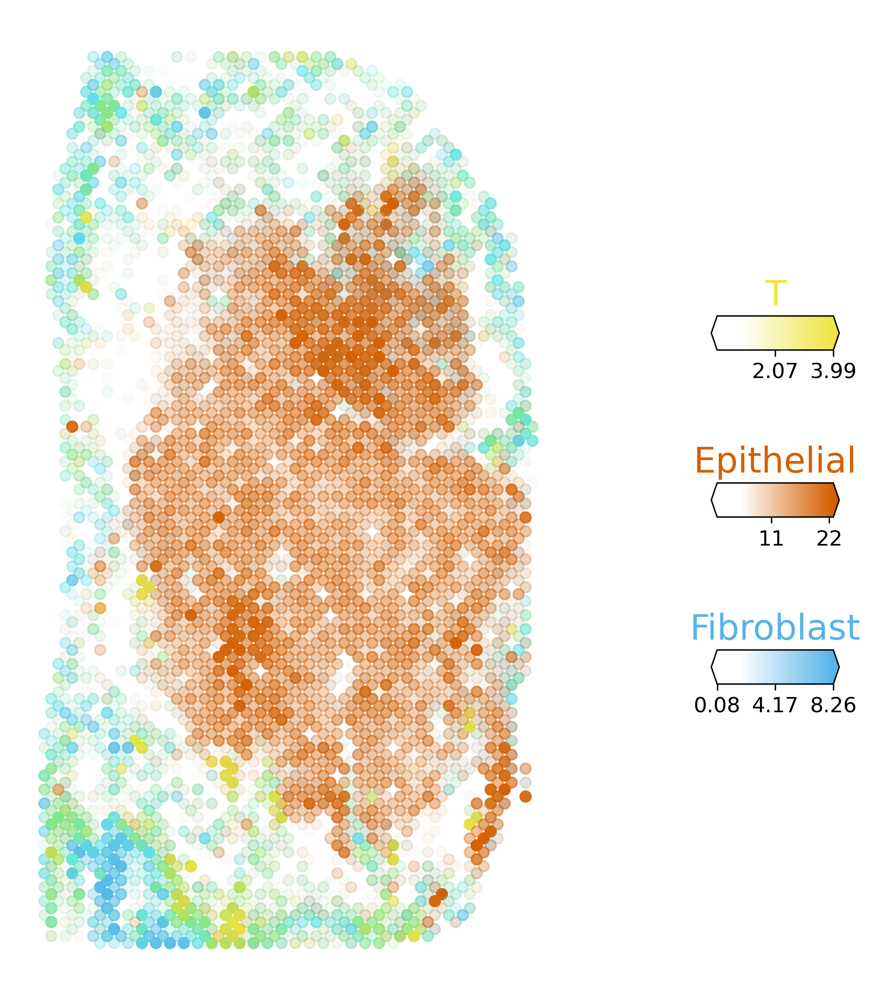

#### Deconvolution with cell2location
Author: "Xiaoqian Jiang"  
Date: "Created on  Feb 07, 2025"  

#### Introduction 
This workflow outlines the process of annotating cell types in spatial transcriptomics data by leveraging single-cell RNA sequencing (scRNA-seq) as a reference. The deconvolution was performed in Python using cell2location, a robust tool for mapping fine-grained cell types across spatial spots. To ensure biological relevance and consistency, the reference dataset was generated from all nine scRNA-seq datasets derived from the same tissue origin.

#### Step 1: Converting scRNA-seq Data from Seurat Object to AnnData 
To prepare the scRNA-seq data as a reference for cell2location, it is necessary to convert the Seurat object into the AnnData format, which is compatible with Python-based tools. This conversion was performed using the sceasy package and SeuratDisk in R. The workflow includes sampling cell numbers for each cell type to ensure efficient and accurate analysis. Below is a concise overview of the conversion process, emphasizing its integration with the broader deconvolution pipeline.

```{r setup, eval=FALSE}
Sys.setenv(LANGUAGE = "en")
options(stringsAsFactors = FALSE)
rm(list=ls())
set.seed(123456)

library(Seurat)
library(patchwork)
library(dplyr) 

# add epithelial sub cell types to all cell types
setwd("C:/Users/xqbus/Desktop/sg_rnaseq/")
getwd()

lnames = load("./rdata/scRNAall.Rdata")
lnames = load("./rdata/Epi_sce.Rdata")
table(Idents(scRNAall))
table(Idents(Epi_sce))

epi_annotations <- Idents(Epi_sce)
names(new_annotations) <- Cells(scRNAall)
new_annotations[Cells(Epi_sce)] <- as.character(epi_annotations)

scRNAall <- AddMetaData(scRNAall, metadata = new_annotations, col.name = "DetailedAnnotation")
table(scRNAall$DetailedAnnotation)
save(scRNAall, file = "./rdata/Updated_scRNAall.Rdata")

# transfer seurat object into anndata object
setwd("C:/Users/xqbus/Desktop/spatial_trans/")
getwd()
library(sceasy)
library(SeuratDisk)

library(reticulate)
# R system use old version in default, and should be changed to squidpy
use_condaenv("squidpy", conda = "C:/Users/xqbus/anaconda3/condabin/conda", required = TRUE)
system('"C:/Users/xqbus/anaconda3/envs/squidpy/python.exe" --version')

load("../sg_rnaseq/rdata/Updated_scRNAall.Rdata")
seurat_obj<- scRNAall

Idents(seurat_obj) <- seurat_obj$DetailedAnnotation
table(Idents(seurat_obj))

allCells=names(Idents(seurat_obj))
allType = levels(Idents(seurat_obj))

N = 1000
choose_Cells = unlist(lapply(allType, function(x){
  cgCells = allCells[Idents(seurat_obj)== x ]
  if (length(cgCells)> N){
    cg=sample(cgCells,N)
  } else{
    cg = cgCells
  }
}))
seurat_obj = seurat_obj[, allCells %in% choose_Cells]
table(Idents(seurat_obj))

seurat_obj[["RNA"]] <- as(seurat_obj[["RNA"]], "Assay")

SaveH5Seurat(seurat_obj, filename = "seurat_obj_updated.h5Seurat")
Convert("seurat_obj_updated.h5Seurat", dest = "h5ad")

sceasy::convertFormat(seurat_obj, from = "seurat", to = "anndata", 
                      outFile = "./anndata/seurat_obj_updated.h5ad",
                      main_layer = "counts" 
                      )
```

#### Step 2: Set the Clean python Environment and Load Required Libraries

```{python step1, eval=FALSE}
# Notice: Ensure that the cell2location environment is activated and that the correct Python interpreter is being used. Verify each time that the Python interpreter path is set to: C:/Users/xqbus/anaconda3/envs/cell2loc_env/python.exe

%reset -f
import sys
print(sys.version)

import os
import scanpy as sc
import pandas as pd
import numpy as np
import anndata as ad

import matplotlib.pyplot as plt
import matplotlib as mpl
import cell2location
from cell2location.utils.filtering import filter_genes

SEED = 42
import random
random.seed(SEED)
np.random.seed(SEED)

# Set the direction 
os.chdir('C:/Users/xqbus/Desktop/spatial_trans') # Your own directory
output_dir = 'C:/Users/xqbus/Desktop/spatial_trans'
output_path = os.path.join(output_dir, "results")
anndata_path =  os.path.join(output_dir, "anndata") # save path of anndata
```

#### Step 3:  Reference cell type preparation

##### Step 3.1: get the raw reference data by scanpy
```{python step2, eval=FALSE}
adata_ref = sc.read_h5ad('anndata/seurat_obj_updated.h5ad')
adata_ref.X = adata_ref.X.astype('int32') # have to convert float64 to int32 to ensure the step: mod.train(max_epochs=25) in the following is smooth, because cell2location need the raw count data as input, which is stored in adata_ref.X and as input of cell2location by default.
adata_ref.var['SYMBOL'] = adata_ref.var.index
adata_ref.var

# standard highly-variable-gene selection 
# recommend to perform very permissive genes selection. We prefer this to standard highly-variable-gene selection because our procedure keeps markers of rare genes while removing most of the uninformative genes
selected = filter_genes(adata_ref, cell_count_cutoff=5, cell_percentage_cutoff2=0.1, nonz_mean_cutoff= 1.12)
adata_ref = adata_ref[:, selected].copy()
```


#####  Step 3.2: Estimation of reference cell type signatures (NB-Negative binomial regression)
```{python step2.1, eval=FALSE}
# prepare anndata object for the regression model
cell2location.models.RegressionModel.setup_anndata(
    adata=adata_ref,
    # 10X reaction / sample / batch
    batch_key='orig.ident',
    # cell type, covariate used for constructing signatures
    labels_key='DetailedAnnotation',
    # multiplicative technical effects (platform, 3' vs 5', donor effect)
    categorical_covariate_keys= None
)

from cell2location.models import RegressionModel
mod = RegressionModel(adata_ref)
# view anndata_setup as a sanity check
mod.view_anndata_setup()
```


#####  Step 3.3: Training model to estimate the reference cell type signatures.
```{python step2.2, eval=FALSE}
# Note that to achieve convergence on your data (=to get stabilization of the loss) you may need to increase max_epochs=500
# Time consuming: 2.5 hours with max_exoport= 500 with 14,000cells with 11,000genes 
mod.train(max_epochs=500) 

# Determine if the model needs more training.
mod.plot_history(10)  # Ensure this command creates a plot
fig = plt.gcf()  # Get the current figure
fig.savefig('./results/cell2_location_reference_train.png', dpi=300, bbox_inches='tight')
```

The plot shows ELBO loss history during training, removing first 20 epochs from the plot. This plot should have a decreasing trend and level off by the end of training. If it is still decreasing, increase max_epochs.
Here, beyond 200 epochs, the loss reduction slows and plateaus, demonstrating that the model has reached a stable state with minimal additional improvement. The convergence of ELBO loss demonstrates that the model has adequately learned the underlying structure of the reference dataset, making it suitable for downstream spatial mapping tasks.

 

##### Step 3.4: Export the estimated cell abundance (the summary statistics of the posterior distribution)

```{python step2.4, eval=FALSE}
# Extract posterior samples from the trained model, which represent the uncertainty of the parameters.
ref_run_name = 'anndata/reference_signatures_update'
run_name = 'anndata/cell2location_map_update'

# num_samples: Specifies the number of posterior samples to draw.
# batch_size: Controls the batch size of data used for inference at a time.
# Time consuming: 2 minutes 
adata_ref = mod.export_posterior(
    adata_ref, sample_kwargs={'num_samples': 1000, 'batch_size': 2500})

# Save model
mod.save(ref_run_name, overwrite=True)
# Save anndata object with results
adata_file = f"{ref_run_name}/sc.h5ad"
adata_ref.write(adata_file)
adata_file

# compute the 5%, 50% and 95% quantiles of the posterior distribution directly rather than using 1000 samples from the distribution (or any other quantiles). This speeds up application on large datasets and requires less memory - however, posterior mean and standard deviation cannot be computed this way.
adata_ref = mod.export_posterior(
    adata_ref, use_quantiles=True,
    # choose quantiles
    add_to_varm=["q05","q50", "q95", "q0001"],
    sample_kwargs={'batch_size': 2500}
)

# Examine QC plots.
# Reconstruction accuracy to assess if there are any issues with inference. The estimated expression signatures are distinct from mean expression in each cluster because of batch effects. For scRNA-seq datasets which do not suffer from batch effect (this dataset has removed batch effect), cluster average expression can be used instead of estimating signatures with a model. When this plot is very different from a diagonal plot (e.g. very low values on Y-axis, density everywhere) it indicates problems with signature estimation.
mod.plot_QC(summary_name="q50")
fig = plt.gcf()  # Get the current figure
fig.savefig('./results/cell2_location_reference_train_q50.png', dpi=300, bbox_inches='tight')
```
This plot demonstrates that the cell2location model effectively learns the reference dataset. The data points align closely along the diagonal, indicating a strong correlation between the actual mean expression and the model's estimated expression. This suggests that the model accurately captures gene expression patterns across different clusters.  

   

#### Step 4: Read spatial visium data and reload reference data

```{python step3, eval=FALSE}
# 4.1 The reference data model and output h5ad can be loaded later like this:
ref_run_name = 'anndata/reference_signatures_update'
run_name = 'anndata/cell2location_map_update'
adata_file = f"{ref_run_name}/sc.h5ad"
adata_ref = sc.read_h5ad(adata_file)
mod = cell2location.models.RegressionModel.load(f"{ref_run_name}", adata_ref)

# 4.2.Extracting reference cell types signatures as a pd.DataFrame.
# All parameters of the a Negative Binomial regression model are exported into reference anndata object, however for spatial mapping we just need the estimated expression of every gene in every cell type. Here we extract that from standard output
if 'means_per_cluster_mu_fg' in adata_ref.varm.keys():
    inf_aver = adata_ref.varm['means_per_cluster_mu_fg'][
        [f'means_per_cluster_mu_fg_{i}' for i in adata_ref.uns['mod']['factor_names']]
    ].copy()
else:
    inf_aver = adata_ref.var[
        [f'means_per_cluster_mu_fg_{i}' for i in adata_ref.uns['mod']['factor_names']]
    ].copy()

inf_aver.columns = adata_ref.uns['mod']['factor_names']
inf_aver.iloc[0:5, 0:5]

# 4.3 Read spatial visium data 
# Based on the results of batch effect correction using Scanorama, I selected TD1, TD3, and TD8 as representative samples for deconvolution across the three stages, as they exhibit minimal batch effects. This approach aligns with the methodology described in the reference paper.
# Reload the processed anndata from local files if your memory is enough
adata_processed = {}

#file_list = [f for f in os.listdir(anndata_path) if f.endswith('_processed.h5ad')]
file_list = ['TD1_processed.h5ad', 'TD3_processed.h5ad', 'TD8_processed.h5ad']

for file_name in file_list:
    sample_id = file_name.replace('_processed.h5ad', '')  # sample ID
    file_path = os.path.join(anndata_path, file_name)
    adata_processed[sample_id] = sc.read(file_path)
    # transfer .X to csr_matrix
    adata_processed[sample_id].X = adata_processed[sample_id].raw.X.copy()
    
adatas = list(adata_processed.values())
sample_names = list(adata_processed.keys())

# Rename the cell from which sample
for adata, sample_name in zip(adatas, sample_names):
    adata.obs['library_id'] = sample_name

adata_vis = sc.concat(adatas, index_unique="-", keys=sample_names, label='library_id',uns_merge="unique")
adata_vis.write_h5ad("anndata/adata_for_cell2location.h5ad")
```

#### Step 5: Cell2location: spatial mapping
```{python step4, eval=FALSE}
import matplotlib.pyplot as plt
from matplotlib.gridspec import GridSpec
from cell2location.plt import plot_spatial

# Find shared genes and prepare anndata. Subset both anndata and reference signatures:
intersect = np.intersect1d(adata_vis.var_names, inf_aver.index)
adata_vis = adata_vis[:, intersect].copy()
inf_aver = inf_aver.loc[intersect, :].copy()

# 5.1 prepare anndata for cell2location model
# cell2location.models.Cell2location.setup_anndata(adata=adata_vis, batch_key="library_id")
cell2location.models.Cell2location.setup_anndata(adata=adata_vis)
 
# 5.2 create and train the model
mod = cell2location.models.Cell2location(
    adata_vis, cell_state_df=inf_aver,
    # the expected average cell abundance: tissue-dependent hyper-prior which can be estimated from paired histology:
    N_cells_per_location=30,
    # relax regularisation of per-location normalisation.  Visium experiments on human tissues suffer from technical effects. This motivates the new default value of detection_alpha=20
    detection_alpha=20
)
mod.view_anndata_setup()

# 5.3.Training cell2location:
# Time consuming: 4 hours for 3000, with 8000 spots    
# Time consuming: 11 hours for 10000, with 8000 spots    
mod.train(max_epochs=3000, # Usually need 10,000, and much time consuming
     # train using full data (batch_size=None)
     batch_size=None,
     # use all data points in training because we need to estimate cell abundance at all locations
     train_size=1,     
)

# plot ELBO loss history during training, removing first 100 epochs from the plot
mod.plot_history(100); plt.legend(labels=['full data training'])

# Exporting estimated posterior distributions of cell abundance and saving results:
adata_vis = mod.export_posterior(adata_vis, sample_kwargs={'num_samples': 1000, 'batch_size': mod.adata.n_obs})

# Save model
mod.save(f"{run_name}", overwrite=True)
# mod = cell2location.models.Cell2location.load(f"{run_name}", adata_vis)
# Save anndata object with results
adata_file = f"{run_name}/sp.h5ad"
adata_vis.write(adata_file)
adata_file                          

# Assessing mapping quality. The plot should be roughly diagonal, strong deviations will signal problems that need to be investigated.
mod.plot_QC()
fig = mod.plot_spatial_QC_across_batches()
```


   

Left: The steady decrease in ELBO loss and eventual plateauing indicate that the model has successfully converged, achieving an optimal balance between data fitting and regularization. The convergence confirms that the model training was robust and the results are reliable for downstream analysis.  
Right: The density of points along the diagonal line indicates the accuracy of the reconstruction, with a close match between predicted and observed values representing high accuracy. The observed alignment demonstrates the model's capability to capture the true spatial distribution of gene expression across spatial locations, indicating reliable deconvolution performance for this dataset.  


#### Step 6: Visualising cell abundance in spatial coordinates
##### Step 6.1: loaded the model and output h5ad
```{python step5, eval=FALSE}
ref_run_name = 'anndata/reference_signatures_update'
run_name = 'anndata/cell2location_map_update'
adata_file = f"{run_name}/sp.h5ad"
adata_vis = sc.read_h5ad(adata_file)
mod = cell2location.models.Cell2location.load(f"{run_name}", adata_vis)

adata_vis.obsm
adata_vis.obsm['q05_cell_abundance_w_sf']

# We use 5% quantile of the posterior distribution, representing the value of cell abundance that the model has high confidence in (aka ‘at least this amount is present’).
# Change the name of column to short cell type, and Add subtype of epithelial to a  total celltype
# Define cell type groupings
cell_type_groups = {
    'Epithelial': ['AT1', 'AT2', 'CRABP2(Cancer)', 'Clara', 'Clara(Cancer)', 'TM4SF1(Cancer)'],
    'Cancer_epi': ['CRABP2(Cancer)', 'Clara(Cancer)', 'TM4SF1(Cancer)'],
    'Normal_epi': ['AT1', 'AT2', 'Clara']
}
# Rename columns in obsm to short names
adata_vis.obsm['q05_cell_abundance_w_sf'].columns = [
    col.replace('q05cell_abundance_w_sf_', '') 
    for col in adata_vis.obsm['q05_cell_abundance_w_sf'].columns
]

# Add new categories to both obsm and obs
for group_name, subtypes in cell_type_groups.items():
    # Sum values for subtypes and add them to both obsm and obs
    summed_values = adata_vis.obsm['q05_cell_abundance_w_sf'][subtypes].sum(axis=1)
    adata_vis.obsm['q05_cell_abundance_w_sf'][group_name] = summed_values
    #adata_vis.obs[group_name] = summed_values
    
# Export updated data to CSV
adata_vis.obsm['q05_cell_abundance_w_sf'].to_csv(f"{run_name}/cell2location_result_update.csv")   
```

##### Step 6.2 select one slide to visulization: TD1 
```{python step6, eval=FALSE}
slide_name = 'TD1'
from cell2location.utils import select_slide
slide = adata_vis[adata_vis.obs['library_id'] == slide_name].copy()

# 6.2.1 Define the cell types to visualize, separately
# cell_types = slide.obsm['q05_cell_abundance_w_sf'].columns
cell_types = ['Epithelial', 'Macrophage', 'Fibroblast','Endothelial','Mast', 'NK']
for cell_type in cell_types:
    slide.obs[cell_type] = slide.obsm['q05_cell_abundance_w_sf'][cell_type]
    
# Set up the figure and grid for subplots
fig = plt.figure(figsize=(15, 10))  # Adjust overall figure size (width, height)
grid = GridSpec(2, 3, figure=fig)  # Create a 2x3 grid layout for 6 subplots

# Plot each cell type's spatial distribution
for i, cell_type in enumerate(cell_types):
    ax = fig.add_subplot(grid[i])  # Add subplot to the grid
    scatter = ax.scatter(
        slide.obsm['spatial'][:, 0],  # X-coordinate (spatial1)
        slide.obsm['spatial'][:, 1],  # Y-coordinate (spatial2)
        c =slide.obsm['q05_cell_abundance_w_sf'][cell_type], #slide.obs[cell_type],  # Color by cell abundance 
        cmap='Reds',  # Set the colormap (e.g., 'viridis', 'Reds', 'magma','Blue','plasma',etc.)
        s=10,  # Set marker size
        edgecolor='none'
    )
    ax.set_title(cell_type)  # Add the cell type as the title of the subplot
    ax.set_xlabel('spatial1')  # Label for X-axis
    ax.set_ylabel('spatial2')  # Label for Y-axis
    ax.invert_yaxis()  # Invert Y-axis to align with spatial transcriptomics convention
    fig.colorbar(scatter, ax=ax, fraction=0.046, pad=0.04)  # Add a colorbar to each subplot

# Adjust layout to prevent overlapping
plt.tight_layout()

# Save the figure to a file
output_path = f'./results/cell2location_cell_type_distribution_{slide_name}.png'
plt.savefig(output_path, dpi=300, bbox_inches='tight')

# Show the figure
plt.show()
```

 

This figure displays the spatial distribution of six major cell types in the TD1 sample, annotated using the cell2location framework. Each hexagonal grid represents a spatial position, with the color intensity indicating the abundance of the respective cell type at that location.
Epithelial cells dominate the center, consistent with their role as the primary functional cells in this tissue, while other cell types, such as macrophages and fibroblasts, are distributed in supportive and immune-related roles.


```{python step7, eval=FALSE}
# Now we use cell2location plotter that allows showing multiple cell types in one panel                   
# 6.2.2 Define 3 cell types (clusters) to display and their corresponding columns in the data
clust_labels = ['T', 'Epithelial', 'Fibroblast']
custom_colors = {'T': 'gold', 'Epithelial': 'darkorange', 'Fibroblast': 'deepskyblue'}
# Plot multiple cell types in one figure
with mpl.rc_context({'figure.figsize': (10, 10)}):  # Adjust the figure size
    fig = plot_spatial(
        adata=slide,
        # Columns containing cell abundance for plotting
        color=clust_labels,
        # Labels for the color bar
        labels=clust_labels,
        # No background image; use spatial coordinates
        show_img=False,
        # 'fast' (white background) or 'dark_background'
        style='fast',
        # Limit color scale at 99.2% quantile of cell abundance
        max_color_quantile=0.992,
        # Size of each spot
        circle_diameter=6,
        # Position of the color bar
        colorbar_position='right'
    )

# Save the figure
fig.savefig(f'./results/multiple_cell_types_distribution_{slide_name}.png', dpi=300, bbox_inches='tight')
```
 

This figure displays the spatial distribution of three major cell types (Epithelial, Fibroblast, and T cells) within the TD1 sample. The visualization combines their abundance across the tissue, as indicated by the color gradients for each cell type. The overlay of multiple cell types highlights the spatial heterogeneity and distinct localization patterns within the tissue microenvironment.

